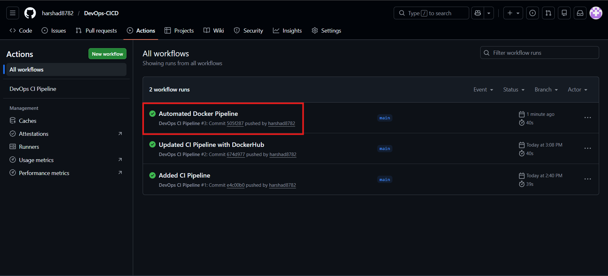
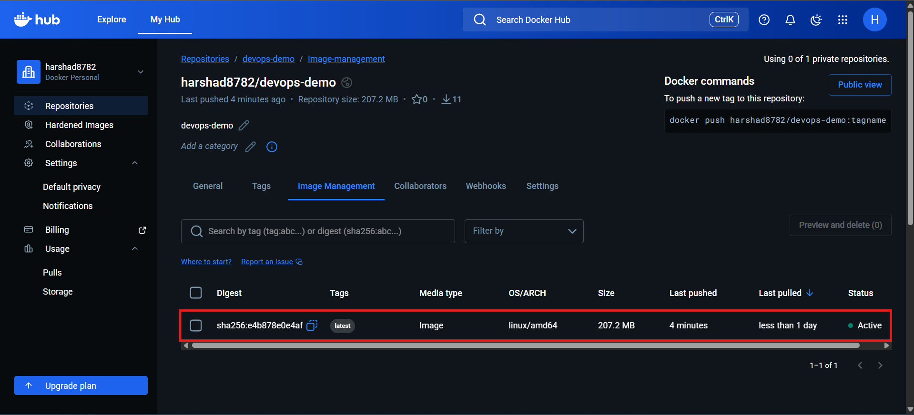
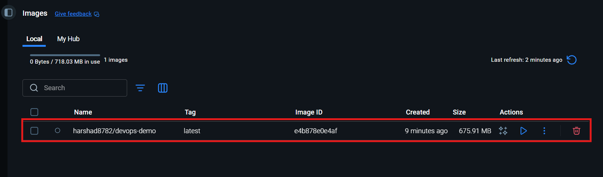
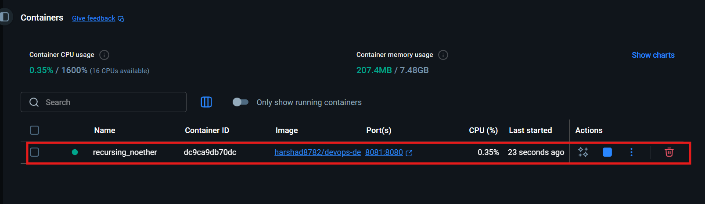

<!-- # 🚀 DevOps CI/CD Pipeline Demo

> A complete end-to-end **DevOps CI/CD pipeline** built with Spring Boot, Docker, and GitHub Actions — demonstrating automated build, containerization, and deployment workflows.

---

## 📌 Project Architecture

```
Developer → GitHub Push → GitHub Actions CI → Maven Build → Docker Image → Docker Hub → Container Deployment
```

---

## 🛠️ Technologies Used

| Tool | Purpose |
|------|---------|
| Java 17 | Application language |
| Spring Boot | Web application framework |
| Maven | Build automation |
| Docker | Containerization |
| GitHub Actions | CI/CD automation |
| Docker Hub | Image registry |
| Git | Version control |

---

## 📂 Project Structure

```
devopsdemo/
├── src/
│   └── main/
│       └── java/
├── Dockerfile
├── pom.xml
├── README.md
└── .github/
    └── workflows/
        └── ci.yml
```

---

## ⚙️ CI/CD Pipeline Workflow

### Step 1 — Code Commit & Push

Developer commits and pushes code to the `main` branch on GitHub:

```bash
git add .
git commit -m "Automated Docker Pipeline"
git push
```

📸 **Git Commit & Push:**


---

### Step 2 — GitHub Actions Triggers Automatically

On every push to `main`, the **GitHub Actions CI Pipeline** is triggered automatically. All 3 pipeline runs completed successfully ✅

📸 **GitHub Actions Pipeline:**



Pipeline configuration file: `.github/workflows/ci.yml`

---

### Step 3 — Docker Image Pushed to Docker Hub

After the build succeeds, the Docker image is automatically built and pushed to **Docker Hub** under `harshad8782/devops-demo`.

📸 **Docker Hub Repository:**



---

### Step 4 — Pull Image from Docker Hub

Pull the latest image to any machine:

```bash
docker pull harshad8782/devops-demo:latest
```

📸 **Image Pulled Locally (Docker Desktop):**



---

### Step 5 — Run the Docker Container

```bash
docker run -p 8081:8080 harshad8782/devops-demo:latest
```

📸 **Container Running (Docker Desktop):**



> Container name: `recursing_noether` | Port: `8081:8080` | CPU: `0.35%`

---

### Step 6 — Application Live in Browser

Access the running application at:

```
http://localhost:8081
```

📸 **Application Live:**


> ✅ **"DevOps CI/CD Pipeline Working!"**

---

## 🐳 Dockerfile

```dockerfile
FROM eclipse-temurin:17
COPY target/*.jar app.jar
ENTRYPOINT ["java", "-jar", "/app.jar"]
```

---

## 🔄 GitHub Actions CI Pipeline

```yaml
# .github/workflows/ci.yml
name: DevOps CI Pipeline

on:
  push:
    branches: [ main ]

jobs:
  build:
    runs-on: ubuntu-latest
    steps:
      - name: Checkout code
        uses: actions/checkout@v3

      - name: Setup Java
        uses: actions/setup-java@v3
        with:
          java-version: '17'
          distribution: 'temurin'

      - name: Build with Maven
        run: mvn clean package

      - name: Build Docker Image
        run: docker build -t harshad8782/devops-demo .

      - name: Push to Docker Hub
        run: |
          echo "${{ secrets.DOCKER_PASSWORD }}" | docker login -u "${{ secrets.DOCKER_USERNAME }}" --password-stdin
          docker push harshad8782/devops-demo:latest
```

---

## 🧪 Running Locally

### 1. Clone the repository

```bash
git clone https://github.com/harshad8782/DevOps-CICD.git
cd DevOps-CICD
```

### 2. Build the Spring Boot application

```bash
mvn clean package
```

### 3. Build Docker image

```bash
docker build -t devopsdemo .
```

### 4. Run the container

```bash
docker run -p 8081:8080 devopsdemo
```

### 5. Open in browser

```
http://localhost:8081
```

---

## 📋 Useful Docker Commands

```bash
# List all running containers
docker ps

# List all images
docker images

# Stop a container
docker stop <container_id>

# Remove a container
docker rm <container_id>

# Pull from Docker Hub
docker pull harshad8782/devops-demo:latest
```

---

## 🔮 Future Enhancements

- [ ] Jenkins CI/CD pipeline integration
- [ ] Kubernetes (K8s) deployment with Helm charts
- [ ] AWS EC2 / ECS deployment
- [ ] Infrastructure as Code with Terraform
- [ ] Monitoring with Prometheus & Grafana
- [ ] Multi-stage Docker builds for smaller image size
- [ ] Automated testing in CI pipeline

---

## 👨‍💻 Author

**Harshad Raurale**  
DevOps / Cloud Enthusiast

[](https://github.com/harshad8782)

---

> ⭐ If you found this project helpful, please consider giving it a star! -->


# 🚀 DevOps CI/CD Pipeline Demo

> A complete end-to-end **DevOps CI/CD pipeline** built with Spring Boot, Docker, GitHub Actions, and Jenkins — demonstrating automated build, containerization, and deployment workflows.

---

## 📌 Project Architecture
```
Developer → GitHub Push → GitHub Actions CI → Maven Build → Docker Image → Docker Hub
                       ↓
                    Jenkins → Clone → Maven Build → Docker Build → Deploy Container
```

---

## 🛠️ Technologies Used

| Tool | Purpose |
|------|---------|
| Java 17 | Application language |
| Spring Boot | Web application framework |
| Maven | Build automation |
| Docker | Containerization |
| GitHub Actions | CI pipeline (cloud) |
| Jenkins | CD pipeline (local/self-hosted) |
| Docker Hub | Image registry |
| Git | Version control |

---

## 📂 Project Structure
```
devopsdemo/
├── src/
│   └── main/
│       └── java/
├── Dockerfile
├── Jenkinsfile
├── pom.xml
├── README.md
└── .github/
    └── workflows/
        └── ci.yml
```

---

## ⚙️ CI/CD Pipeline Workflow

### Step 1 — Code Commit & Push

Developer commits and pushes code to the `main` branch on GitHub:
```bash
git add .
git commit -m "Automated Docker Pipeline"
git push
```

📸 **Git Commit & Push:**


---

### Step 2 — GitHub Actions Triggers Automatically

On every push to `main`, the **GitHub Actions CI Pipeline** is triggered automatically. All pipeline runs completed successfully ✅

📸 **GitHub Actions Pipeline:**


Pipeline configuration file: `.github/workflows/ci.yml`

---

### Step 3 — Docker Image Pushed to Docker Hub

After the build succeeds, the Docker image is automatically built and pushed to **Docker Hub** under `harshad8782/devops-demo`.

📸 **Docker Hub Repository:**


---

### Step 4 — Jenkins Pipeline Triggered

Jenkins pulls the latest code, builds the Maven project, builds the Docker image, and deploys the container locally.

**Jenkins Pipeline Stages:**
- ✅ Clone Repository
- ✅ Build Maven
- ✅ Build Docker Image
- ✅ Run Container
- ✅ Verify Deployment

---

### Step 5 — Pull Image from Docker Hub

Pull the latest image to any machine:
```bash
docker pull harshad8782/devops-demo:latest
```

📸 **Image Pulled Locally (Docker Desktop):**


---

### Step 6 — Run the Docker Container
```bash
docker run -p 8081:8080 harshad8782/devops-demo:latest
```

📸 **Container Running (Docker Desktop):**


> Container name: `devops-app` | Port: `8081:8080`

---

### Step 7 — Application Live in Browser

Access the running application at:
```
http://localhost:8081
```

📸 **Application Live:**


> ✅ **"DevOps CI/CD Pipeline Working!"**

---

## 🐳 Dockerfile
```dockerfile
FROM eclipse-temurin:17
COPY target/*.jar app.jar
ENTRYPOINT ["java", "-jar", "/app.jar"]
```

---

## 🔄 GitHub Actions CI Pipeline
```yaml
# .github/workflows/ci.yml
name: DevOps CI Pipeline

on:
  push:
    branches: [ main ]

jobs:
  build:
    runs-on: ubuntu-latest
    steps:
      - name: Checkout code
        uses: actions/checkout@v3

      - name: Setup Java
        uses: actions/setup-java@v3
        with:
          java-version: '17'
          distribution: 'temurin'

      - name: Build with Maven
        run: mvn clean package

      - name: Build Docker Image
        run: docker build -t harshad8782/devops-demo .

      - name: Push to Docker Hub
        run: |
          echo "${{ secrets.DOCKER_PASSWORD }}" | docker login -u "${{ secrets.DOCKER_USERNAME }}" --password-stdin
          docker push harshad8782/devops-demo:latest
```

---

## 🏗️ Jenkins CD Pipeline
```groovy
pipeline {
    agent any

    environment {
        IMAGE_NAME = 'devops-cicd'
        IMAGE_TAG = 'latest'
        CONTAINER_NAME = 'devops-app'
        APP_PORT = '8081'
        CONTAINER_PORT = '8080'
    }

    stages {

        stage('Clone Repository') {
            steps {
                echo '📥 Cloning repository from GitHub...'
                git branch: 'main',
                    url: 'https://github.com/harshad8782/DevOps-CICD.git'
            }
        }

        stage('Build Maven') {
            steps {
                echo '⚙️ Building Maven project...'
                sh 'chmod +x mvnw'
                sh './mvnw clean package -DskipTests'
            }
        }

        stage('Build Docker Image') {
            steps {
                echo '🐳 Building Docker image...'
                sh 'docker build -t ${IMAGE_NAME}:${IMAGE_TAG} .'
            }
        }

        stage('Run Container') {
            steps {
                echo '🚀 Deploying container...'
                sh 'docker stop ${CONTAINER_NAME} || true'
                sh 'docker rm ${CONTAINER_NAME} || true'
                sh '''
                    docker run -d \
                        --name ${CONTAINER_NAME} \
                        -p ${APP_PORT}:${CONTAINER_PORT} \
                        --restart unless-stopped \
                        ${IMAGE_NAME}:${IMAGE_TAG}
                '''
            }
        }

        stage('Verify Deployment') {
            steps {
                echo '✅ Verifying deployment...'
                sh 'sleep 5'
                sh 'docker ps | grep ${CONTAINER_NAME}'
                sh 'docker logs ${CONTAINER_NAME} --tail=20'
            }
        }
    }

    post {
        success {
            echo '✅ Pipeline succeeded! App running at http://localhost:8081'
        }
        failure {
            echo '❌ Pipeline failed! Check logs above for errors.'
        }
        always {
            sh 'docker image prune -f'
        }
    }
}
```

---

## 🧪 Running Locally

### 1. Clone the repository
```bash
git clone https://github.com/harshad8782/DevOps-CICD.git
cd DevOps-CICD
```

### 2. Build the Spring Boot application
```bash
mvn clean package
```

### 3. Build Docker image
```bash
docker build -t devopsdemo .
```

### 4. Run the container
```bash
docker run -p 8081:8080 devopsdemo
```

### 5. Open in browser
```
http://localhost:8081
```

---

## 📋 Useful Docker Commands
```bash
# List all running containers
docker ps

# List all images
docker images

# Stop a container
docker stop <container_id>

# Remove a container
docker rm <container_id>

# Pull from Docker Hub
docker pull harshad8782/devops-demo:latest
```

---

## 🔮 Future Enhancements

- [x] Jenkins CI/CD pipeline integration ✅
- [ ] Kubernetes (K8s) deployment with Helm charts
- [ ] AWS EC2 / ECS deployment
- [ ] Infrastructure as Code with Terraform
- [ ] Monitoring with Prometheus & Grafana
- [ ] Multi-stage Docker builds for smaller image size
- [ ] Automated testing in CI pipeline

---

## 👨‍💻 Author

**Harshad Raurale**  
DevOps / Cloud Enthusiast

[](https://github.com/harshad8782)

---

> ⭐ If you found this project helpful, please consider giving it a star!