# 🚀 DevOps CI/CD Pipeline

> A complete end-to-end **DevOps CI/CD pipeline** built with Spring Boot, Docker, GitHub Actions, Terraform, and AWS — demonstrating automated build, containerization, cloud infrastructure provisioning, deployment workflows, production-grade log analysis, code quality gates, security scanning, and email alerting.

---

## 📌 Evolution — From Local to Cloud

This project went through two major architectural phases. Both are documented here to show the real-world progression of a DevOps pipeline.

---

### 🔵 Phase 1 — Original Architecture (Local Jenkins + Docker Hub)

```
Developer → GitHub Push
                ↓
        GitHub Actions (CI)
                ↓
    Maven Build → JUnit Tests → JaCoCo Coverage
                ↓
    SonarCloud Quality Gate → Trivy Security Scan
                ↓
    Docker Build → Push to Docker Hub
                ↓
        Jenkins (CD) — Local / Self-Hosted
                ↓
    Clone Repo → Pull Image from Docker Hub
                ↓
    Run Container → Health Check (retry 5x)
                ↓
    Log Analysis (Bash / PowerShell via isUnix())
                ↓
    ✅ Pass  → Verify & Email Alert + Stats Report
    🔴 Fail  → Auto Rollback + Email Alert + Stats Report
```

| Tool | Role |
|------|------|
| GitHub Actions | CI only — build, test, quality, push |
| Jenkins (local) | CD only — deploy, health check, log analysis |
| Docker Hub | Image registry |
| Bash / PowerShell | Log analysis with OS detection via `isUnix()` |
| Email (SMTP via Jenkins) | Pipeline alerts with stats report attached |

---

### 🟠 Phase 2 — Current Architecture (GitHub Actions + Terraform + AWS)

```
Developer → GitHub Push to main
                ↓
    ━━━━━━━━━━━━━━━━━━━━━━━━━━━━━━━━━━━━━━━
              ci.yml — GitHub Actions CI
    ━━━━━━━━━━━━━━━━━━━━━━━━━━━━━━━━━━━━━━━
    Checkout → Maven Build → JUnit Tests
                ↓
    JaCoCo Coverage → SonarCloud Quality Gate
                ↓
    Configure AWS → Login to ECR
                ↓
    Docker Build → Trivy Security Scan
                ↓
    Push versioned image to Amazon ECR
    (devops-demo:v1.71.0 + devops-demo:latest)
                ↓
    ━━━━━━━━━━━━━━━━━━━━━━━━━━━━━━━━━━━━━━━
         cd.yml — GitHub Actions CD
         (triggers automatically on CI success)
    ━━━━━━━━━━━━━━━━━━━━━━━━━━━━━━━━━━━━━━━
                ↓
    JOB 1 — Terraform Provision Infrastructure
      ├── terraform init (S3 remote state)
      ├── Clean stale IAM resources
      ├── terraform plan → terraform apply
      ├── Creates: Key Pair, IAM Role, Security Group,
      │           EC2 Instance, Elastic IP
      └── Extract EC2 IP + PEM key from outputs
                ↓
    JOB 2 — Deploy → Health Check → Log Analysis → Email
      ├── Write PEM key to runner
      ├── Wait for Docker + AWS CLI ready on EC2
      ├── Fetch latest versioned tag from ECR
      ├── SSH → ECR login → docker pull → docker run
      ├── Auto rollback if deploy fails
      ├── Health check (5 retries × 10s) → rollback on fail
      ├── OS detection → run log_analyzer.sh on EC2
      ├── Copy stats report back → upload as artifact
      ├── Send email alert with report attached
      └── Cleanup PEM key from runner
```

---

## 🛠️ Technologies Used

| Tool | Purpose |
|------|---------|
| Java 17 | Application language |
| Spring Boot | Web application framework |
| Maven | Build automation |
| JUnit | Unit testing |
| JaCoCo | Code coverage reporting |
| SonarCloud | Code quality gate |
| Trivy | Docker image security scanning |
| Docker | Containerization |
| GitHub Actions | Full CI + CD pipeline (cloud) |
| Terraform | Infrastructure as Code — provisions all AWS resources |
| Amazon ECR | Private Docker image registry |
| Amazon EC2 | Cloud server running the application |
| Amazon S3 | Terraform remote state storage (versioned) |
| AWS IAM | EC2 role with ECR read access (no hardcoded keys) |
| Bash Scripting | Log analysis & DevOps automation (Linux) |
| PowerShell | Log analysis & DevOps automation (Windows) |
| Email (SMTP / Gmail) | Pipeline alert notifications |

---

## 📂 Project Structure

```
DevOps-CICD/
├── src/
│   └── main/java/com/devops/devopsdemo/
│       ├── DevopsdemoApplication.java
│       └── HelloController.java
│   └── test/java/com/devops/devopsdemo/
│       └── DevopsdemoApplicationTests.java
├── terraform/
│   ├── main.tf           ← EC2, IAM, Security Group, EIP, Key Pair
│   ├── variables.tf      ← aws_region, instance_type, app_name
│   ├── outputs.tf        ← ec2_public_ip, ssh_command, app_url
│   └── userdata.sh       ← Installs Docker + AWS CLI on EC2 at boot
├── .github/
│   └── workflows/
│       ├── ci.yml        ← Build, Test, Quality, Security, Push to ECR
│       └── cd.yml        ← Terraform Infra + Deploy + Health Check + Email
├── Dockerfile            ← Multi-stage build (295MB vs 676MB single-stage)
├── log_analyzer.sh       ← Linux/Mac log analysis
├── log_analyzer.ps1      ← Windows log analysis
├── pom.xml
└── README.md
```

---

## ⚙️ CI/CD Pipeline Workflow

### Step 1 — Code Commit & Push

```bash
git add .
git commit -m "Add GitHub Actions CI/CD with Terraform"
git push origin main
```

📸 **Git Commit & Push:**

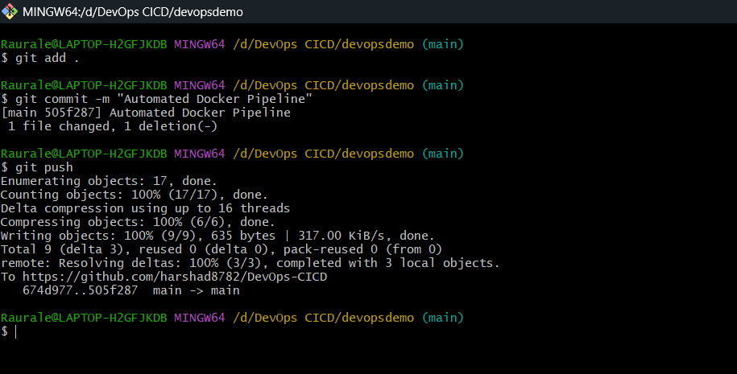

---

### Step 2 — GitHub Actions CI Triggers Automatically

On every push to `main`, the full CI pipeline runs automatically:

```
Checkout → Build → Unit Tests → Coverage → SonarCloud → Docker Build → Trivy → Push to ECR
```

📸 **GitHub Actions CI Pipeline — Success (#71, 2m 10s):**

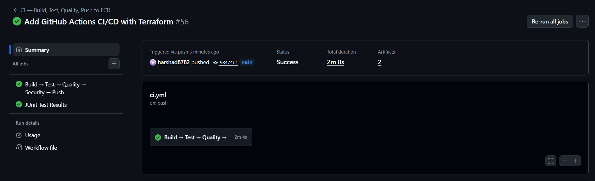

---

### Step 3 — Unit Tests — JUnit

Every push runs all JUnit tests automatically. Build is blocked if any test fails.

```
✅ contextLoads
✅ testHelloEndpoint
```

---

### Step 4 — Code Coverage — JaCoCo

JaCoCo generates a full coverage report after tests run. Report is uploaded as a GitHub Actions artifact.

📸 **JaCoCo Coverage Report:**

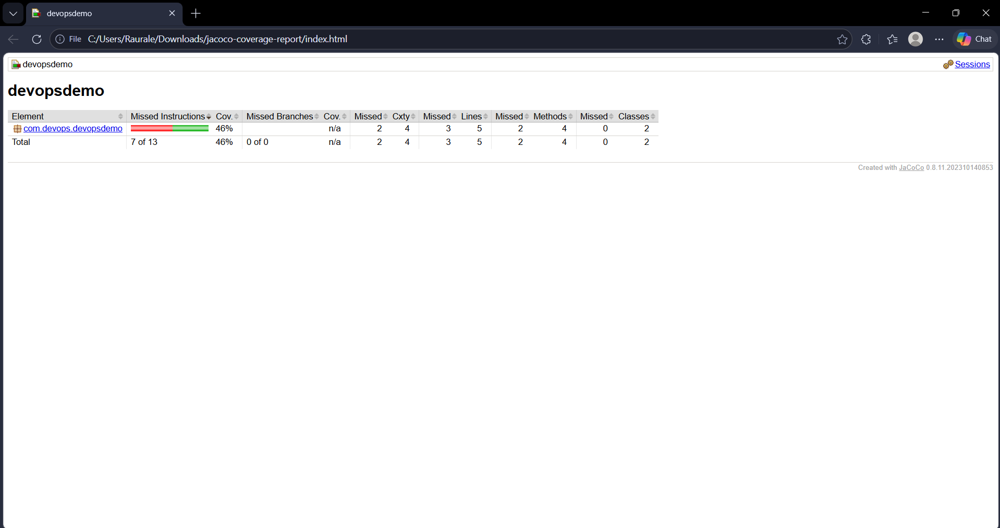

```
Coverage    : 46%
Lines       : 5 total, 3 covered
Methods     : 4 total, 2 covered
Classes     : 2 total, 2 covered
```

---

### Step 5 — Code Quality Gate — SonarCloud

Every push is automatically scanned by SonarCloud for bugs, vulnerabilities, code smells, and coverage.

📸 **SonarCloud Dashboard:**

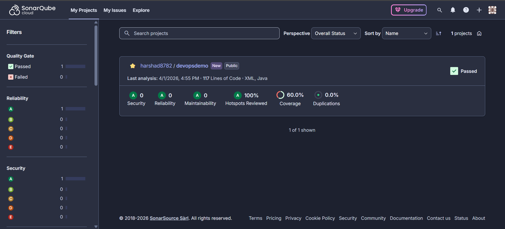

```
Quality Gate    : ✅ Passed
Security        : A
Reliability     : A
Maintainability : A
Coverage        : 60%
Duplications    : 0%
Hotspots        : 100% Reviewed
```

---

### Step 6 — Security Scan — Trivy

Docker image is scanned for CRITICAL and HIGH vulnerabilities before pushing to ECR.

📸 **Trivy Security Report:**

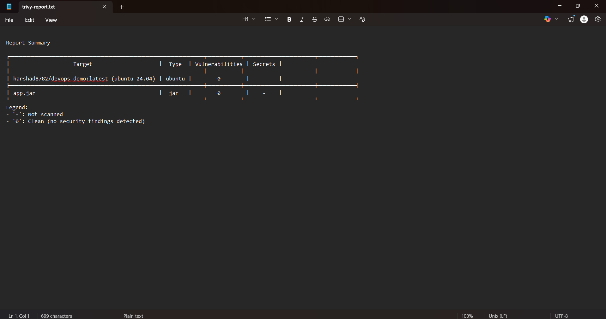

```
Target             : devops-demo:latest (ubuntu 24.04)
Vulnerabilities    : 0 ✅
Secrets            : None detected ✅
app.jar            : 0 vulnerabilities ✅
```

---

### Step 7 — Versioned Docker Image Pushed to Amazon ECR

Every build pushes two tags — versioned and latest. ECR keeps a full history of all versions.

```bash
devops-demo:v1.71.0   ← versioned tag (matches github.run_number)
devops-demo:latest    ← always points to newest
```

📸 **Amazon ECR Repository — Versioned Image History:**

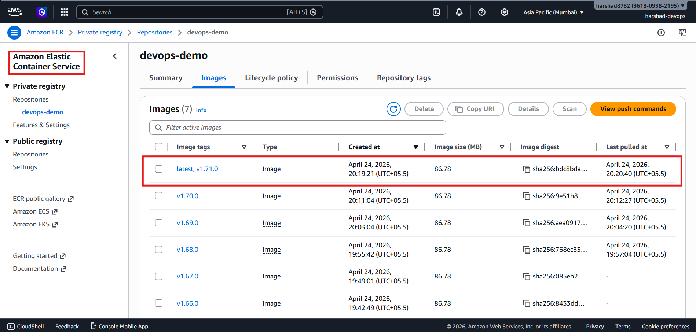

---

### Step 8 — Terraform Provisions AWS Infrastructure

Before deploying, Terraform creates or updates all cloud infrastructure automatically. State is stored remotely in S3 so it persists across runs.

📸 **S3 Bucket Created for Terraform State:**

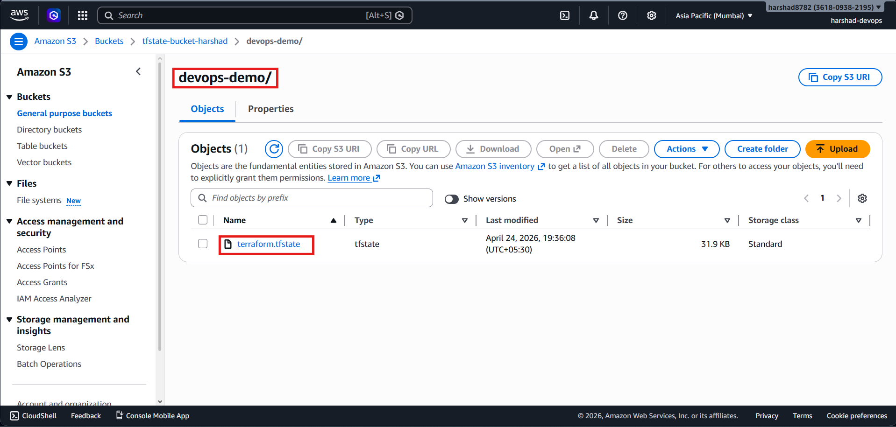

📸 **S3 Versioning Enabled on State Bucket:**

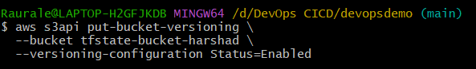

📸 **S3 Bucket — tfstate-bucket-harshad — devops-demo/ folder:**

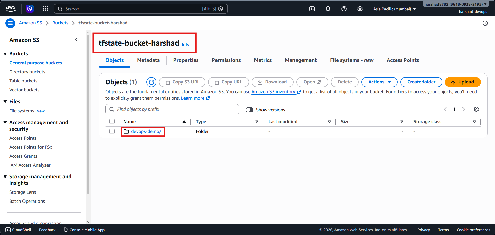

📸 **terraform.tfstate stored in S3 (31.9 KB):**

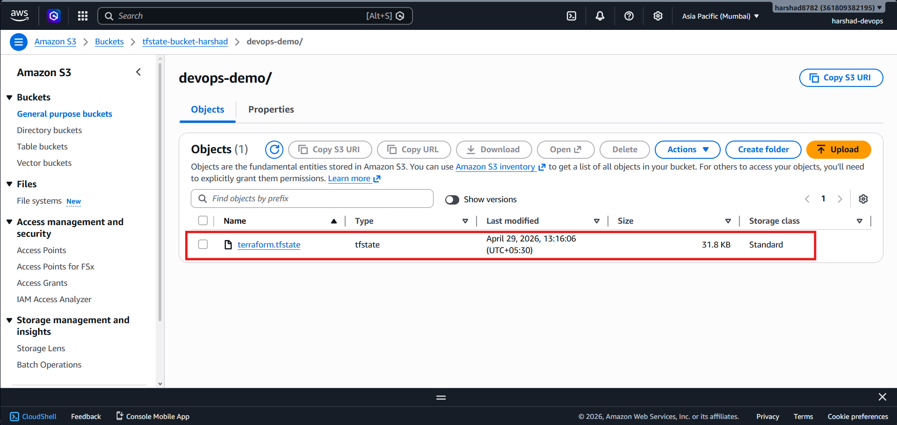

**AWS Resources Terraform manages:**

```
Amazon S3
    └── tfstate-bucket-harshad/devops-demo/terraform.tfstate

Amazon ECR
    └── devops-demo repository (versioned images)

Amazon EC2
    ├── Ubuntu 24.04, t3.micro, ap-south-1
    ├── IAM Role: AmazonEC2ContainerRegistryReadOnly
    ├── Security Group: ports 22, 80, 8081
    ├── Elastic IP: stable public IP
    └── userdata.sh: Docker + AWS CLI at boot

AWS Key Pair
    └── devops-demo-keypair.pem (Terraform-generated, RSA 4096)
```

---

### Step 9 — EC2 Ready — Docker + AWS CLI Installed

`userdata.sh` runs automatically at EC2 boot. The CD pipeline polls until both Docker and AWS CLI confirm ready before proceeding to deploy.

📸 **EC2 Setup Complete — Docker and AWS CLI Ready:**

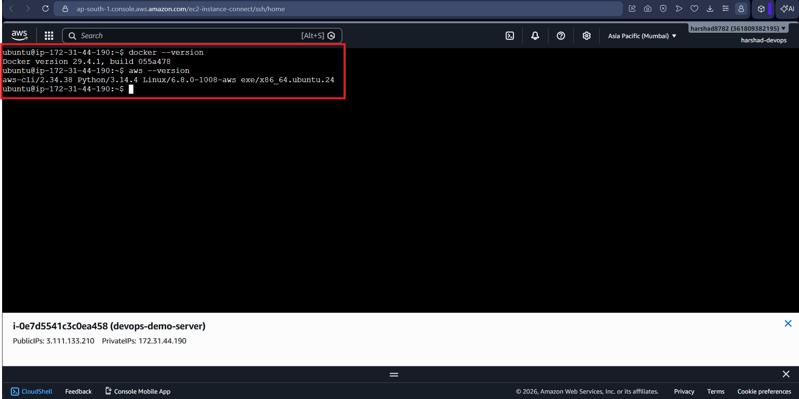

```
✅ EC2 ready — Docker and AWS CLI installed
✅ Deployment will be triggered by GitHub Actions CD workflow
Docker version 29.4.1
aws-cli/2.34.36
```

---

### Step 10 — CD Pipeline Deploys to EC2

After Terraform finishes and EC2 is ready, the deploy job SSHs in using the Terraform-generated `.pem` key, pulls the verified image from ECR via IAM role (no hardcoded credentials), and starts the container.

📸 **GitHub Actions CD Pipeline — All Stages Green (#17, 1m 42s):**

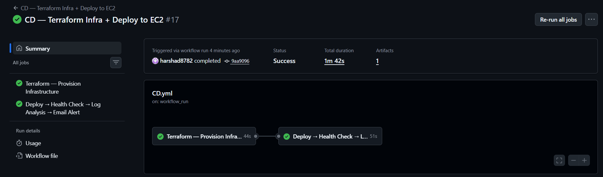

```
✅ Terraform — Provision Infrastructure   44s
✅ Deploy → Health Check → Log Analysis   51s
Total duration: 1m 42s
```

**Jenkins Pipeline Stages (Phase 1 — for reference):**

📸 **Jenkins Pipeline — All Stages Green:**

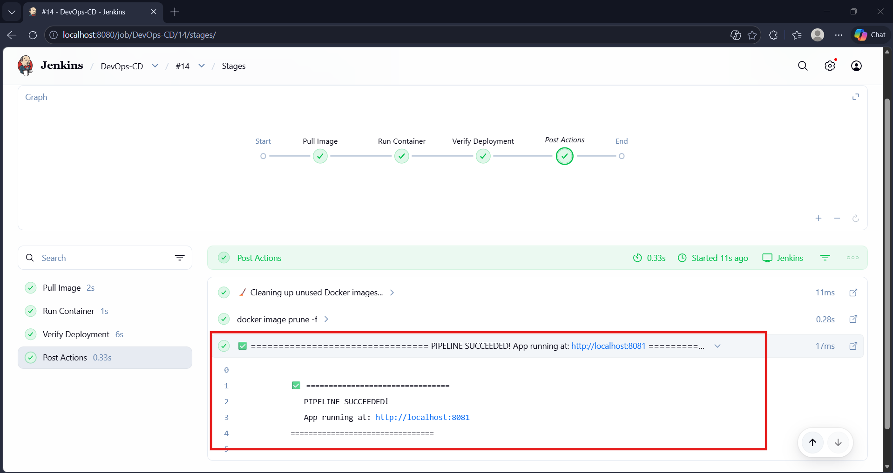

---

### Step 11 — Auto Rollback on Failure

Before deploying, the pipeline saves the current running image version. If deployment or health check fails after 5 retries, the previous version is automatically restored.

```
Save current container image version
        ↓
Deploy new version
        ↓
Health Check — retry 5 times × 10s
        ├── ✅ Healthy → proceed to log analysis
        └── ❌ Failed  → auto rollback to previous image
```

---

### Step 12 — Log Analysis Runs Automatically

After the container passes the health check, `log_analyzer.sh` is SCP'd to EC2, executed remotely, and the stats report is copied back to the GitHub Actions runner and uploaded as an artifact (14-day retention).

**isUnix() — Jenkins vs GitHub Actions:**

```groovy
// Jenkins (Groovy)
if (isUnix()) {
    sh './log_analyzer.sh'
} else {
    powershell '.\\log_analyzer.ps1'
}
```

```bash
# GitHub Actions (Bash — equivalent logic)
if [ "$(uname)" = "Linux" ] || [ "$(uname)" = "Darwin" ]; then
    # SCP + run log_analyzer.sh on EC2
else
    # run log_analyzer.ps1 (Windows self-hosted runner)
fi
```

📸 **Success Email Received:**

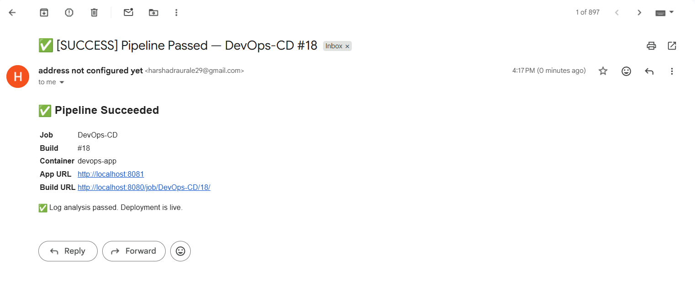

📸 **Stats Report Attached to Email:**

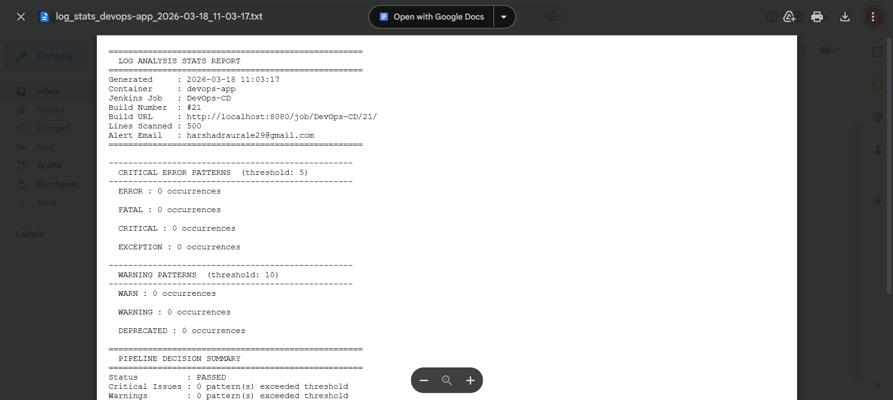

📸 **Critical Failure Email — Deployment Blocked:**

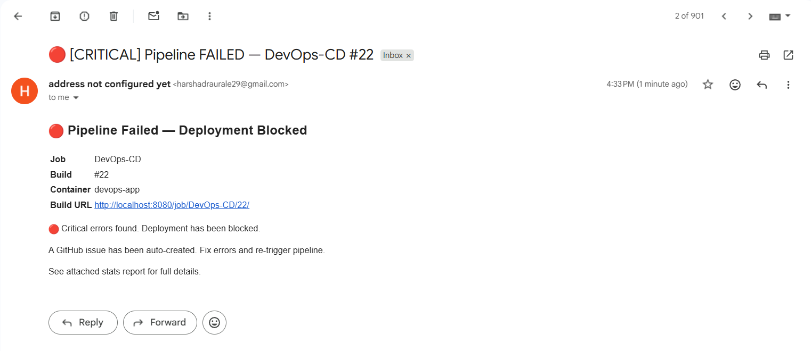

**Sample stats report:**

```
====================================================
  LOG ANALYSIS STATS REPORT
====================================================
Generated     : 2026-04-24 20:20:40
Container     : devops-app
Job           : CD — Terraform Infra + Deploy to EC2
Build Number  : #17
Lines Scanned : 500
====================================================

  CRITICAL ERROR PATTERNS  (threshold: 5)
  ERROR     : 0 occurrences
  FATAL     : 0 occurrences
  CRITICAL  : 0 occurrences
  EXCEPTION : 0 occurrences

  WARNING PATTERNS  (threshold: 10)
  WARN       : 0 occurrences
  WARNING    : 0 occurrences
  DEPRECATED : 0 occurrences

====================================================
  PIPELINE DECISION SUMMARY
====================================================
Status   : PASSED
Action   : All checks passed. Deployment is proceeding.
====================================================
```

---

### Step 13 — Application Live on EC2

```
http://<EC2_ELASTIC_IP>:8081
```

📸 **Application Live in Browser:**

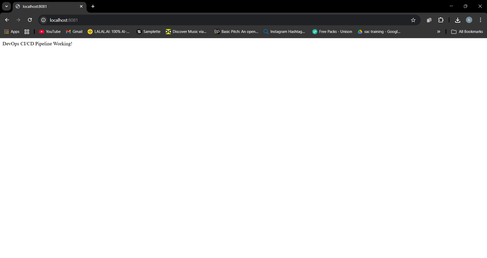

> ✅ **"DevOps CI/CD Pipeline Working!"**

---

## 🔍 Automated Log Analysis

**How it works:**

```
Container starts on EC2
        ↓
GitHub Actions runner detects OS (mirrors Jenkins isUnix()):
    Linux/Darwin  →  log_analyzer.sh   ✅ always on GitHub cloud runners
    Windows       →  log_analyzer.ps1  ← self-hosted Windows runner
        ↓
SCP script to EC2 → Execute remotely → SCP stats report back
        ↓
Fetches last 500 lines from docker logs
        ↓
Scans for ERROR, FATAL, CRITICAL, EXCEPTION  → threshold: 5
Scans for WARN, WARNING, DEPRECATED          → threshold: 10
        ↓
        ├── All clean      → exit 0 → ✅ SUCCESS  → email + stats.txt
        ├── Warnings only  → exit 2 → 🟡 UNSTABLE → email + stats.txt
        └── Critical found → exit 3 → 🔴 FAILURE  → blocked + email + stats.txt
```

**Pipeline decision table:**

| Result | Exit Code | Status | Action Taken |
|---|---|---|---|
| No issues found | 0 | ✅ SUCCESS | Deployment live, email + report sent |
| Warnings > threshold | 2 | 🟡 UNSTABLE | Deploy allowed, team emailed with report |
| Critical errors > threshold | 3 | 🔴 FAILURE | Deployment blocked, team emailed with report |

**Bash vs PowerShell — same logic, different platform:**

| Concept | Bash (`log_analyzer.sh`) | PowerShell (`log_analyzer.ps1`) |
|---|---|---|
| Variable | `VAR="value"` | `$VAR = "value"` |
| Environment var | `${VAR:-default}` | `if ($env:VAR) { $env:VAR }` |
| Function | `myFunc() { }` | `function My-Func { }` |
| Pattern match | `grep -i -c "pattern"` | `Select-String -Pattern "pattern"` |
| Write file | `echo "text" >> file` | `"text" \| Out-File -Append` |
| Exit code | `exit 3` | `exit 3` |

---

## 🐳 Dockerfile — Multi-Stage Build

```dockerfile
# Stage 1 — Build
FROM maven:3.9.9-eclipse-temurin-17 AS builder
WORKDIR /app
COPY pom.xml .
COPY src ./src
RUN mvn clean package -DskipTests

# Stage 2 — Run
FROM eclipse-temurin:17-jre-alpine
WORKDIR /app
COPY --from=builder /app/target/*.jar app.jar
ENTRYPOINT ["java", "-jar", "app.jar"]
```

```
Single-stage image  →  676 MB
Multi-stage image   →  295 MB
Reduction           →  56% smaller ✅
```

---

## 💡 CI vs CD — Why Separated?

| | ci.yml (CI) | cd.yml (CD) |
|---|---|---|
| **Trigger** | Every `git push` to main | After CI succeeds via `workflow_run` |
| **Responsibility** | Build, test, quality, security, push | Infra provision, deploy, verify, alert |
| **Runs on** | GitHub cloud runners | GitHub cloud runners |
| **Registry** | Pushes to Amazon ECR | Pulls from Amazon ECR |
| **Output** | Verified versioned Docker image | Running container on EC2 + email alert |

> Separating CI and CD is a real-world best practice — deploy only what has been built, tested, and verified.

---

## 🏭 Production-Grade Pipeline at a Glance

```
Developer pushes code
        ↓
━━━━━━━━━━━━━━━━━━━━━━━━  CI — ci.yml  ━━━━━━━━━━━━━━━━━━━━━━━━
    Build → Unit Tests (JUnit)                    ✅
        ↓
    Code Coverage (JaCoCo)                        ✅
        ↓
    Code Quality Gate (SonarCloud) ──FAIL──→ ❌ Block
        ↓
    Security Scan (Trivy)                         ✅
        ↓
    Build versioned image → ECR                   ✅
        ↓
━━━━━━━━━━━━━━━━━━━━━━━━  CD — cd.yml  ━━━━━━━━━━━━━━━━━━━━━━━━
    Terraform Apply (EC2 + IAM + EIP + S3 state)  ✅
        ↓
    Wait for EC2 ready (Docker + AWS CLI)         ✅
        ↓
    SSH Deploy with Auto Rollback                 ✅
        ↓
    Health Check (retry 5x) ──FAIL──→ 🔴 Auto Rollback
        ↓
    Log Analysis (Bash / PowerShell)              ✅
        ├── exit 0 → ✅ SUCCESS  email + stats report
        ├── exit 2 → 🟡 UNSTABLE email + stats report
        └── exit 3 → 🔴 FAILURE  blocked + email + stats report
        ↓
    Verify Deployment                             ✅
        ↓
    ✅ App live at http://<EC2_ELASTIC_IP>:8081
```

---

### 🔁 Deployment Strategies

| Strategy | How it works | Risk | Use Case |
|---|---|---|---|
| **Recreate** ← used here | Stop old, start new | High — brief downtime | Dev/demo |
| **Rolling** | Replace instances one by one | Medium | Standard production |
| **Blue/Green** | Two identical envs, switch traffic | Low | High availability |
| **Canary** | Release to small % first, then scale | Very Low | Large user base |
| **Feature Flags** | Code ships, feature toggled per user | Minimal | A/B testing |

---

### 📊 Production Monitoring Stack (Planned)

| Tool | Purpose |
|---|---|
| **Prometheus** | Metrics — CPU, memory, request rate, error rate |
| **Grafana** | Dashboard visualisation |
| **ELK Stack** | Centralised log collection and search |
| **AWS CloudWatch** | Cloud-native monitoring for EC2 / containers |
| **PagerDuty / OpsGenie** | On-call alerts to engineers |

---

## 🔐 GitHub Secrets Required

| Secret | Description |
|---|---|
| `AWS_ACCESS_KEY_ID` | IAM user access key |
| `AWS_SECRET_ACCESS_KEY` | IAM user secret key |
| `AWS_REGION` | `ap-south-1` |
| `AWS_ACCOUNT_ID` | 12-digit AWS account ID |
| `ECR_REPOSITORY` | ECR repo name (`devops-demo`) |
| `TF_STATE_BUCKET` | S3 bucket name (`tfstate-bucket-harshad`) |
| `SONAR_TOKEN` | SonarCloud project token |
| `SMTP_USERNAME` | Gmail address for sending alerts |
| `SMTP_PASSWORD` | Gmail App Password |
| `ALERT_EMAIL` | Recipient email for pipeline alerts |

---

## 🔮 Feature Progress

- [x] Maven build automation ✅
- [x] Unit testing with JUnit ✅
- [x] Code coverage with JaCoCo ✅
- [x] Code quality gate with SonarCloud ✅
- [x] Security scanning with Trivy ✅
- [x] Versioned Docker image tags ✅
- [x] Multi-stage Dockerfile (56% smaller) ✅
- [x] Private image registry — Amazon ECR ✅
- [x] Infrastructure as Code — Terraform ✅
- [x] Remote Terraform state — S3 + versioning enabled ✅
- [x] EC2 provisioning with Elastic IP ✅
- [x] IAM Role for ECR access (no hardcoded credentials) ✅
- [x] Auto rollback on deployment failure ✅
- [x] Health check after deployment ✅
- [x] Automated log analysis — Bash + PowerShell ✅
- [x] OS detection (mirrors Jenkins `isUnix()`) ✅
- [x] Stats report auto-generated and attached to email ✅
- [x] Full GitHub Actions CI + CD (Jenkins removed) ✅
- [ ] Deploy to multiple environments (staging → production)
- [ ] Canary deployment strategy
- [ ] Monitoring with Prometheus + Grafana
- [ ] Kubernetes deployment with Helm charts
- [ ] Infrastructure multi-region support

---

## 🧪 Running Locally

```bash
git clone https://github.com/harshad8782/DevOps-CICD.git
cd DevOps-CICD
mvn clean package
docker build -t devopsdemo .
docker run -p 8081:8080 devopsdemo
```

Open: `http://localhost:8081`

---

## 📋 Useful Commands

```bash
# Docker
docker ps
docker logs devops-app --tail=50
docker stop devops-app && docker rm devops-app

# Terraform (from terraform/ directory)
terraform init
terraform plan
terraform apply
terraform destroy

# AWS ECR — list images
aws ecr describe-images \
  --repository-name devops-demo \
  --region ap-south-1

# AWS S3 — check state
aws s3 ls s3://tfstate-bucket-harshad/devops-demo/

# AWS EC2 — get public IP
aws ec2 describe-instances \
  --filters "Name=tag:Name,Values=devops-demo-server" \
  --query "Reservations[*].Instances[*].PublicIpAddress"
```

---

## 👨‍💻 Author

**Harshad Raurale**
DevOps / Cloud Enthusiast

[](https://github.com/harshad8782)
[](https://www.linkedin.com/in/harshad-raurale-9a4b4826b/)
[](https://sonarcloud.io/summary/new_code?id=harshad8782_DevOps-CICD)
[](https://sonarcloud.io/summary/new_code?id=harshad8782_DevOps-CICD)
[](https://sonarcloud.io/summary/new_code?id=harshad8782_DevOps-CICD)
[](https://sonarcloud.io/summary/new_code?id=harshad8782_DevOps-CICD)

---

> ⭐ If you found this project helpful, please consider giving it a star!